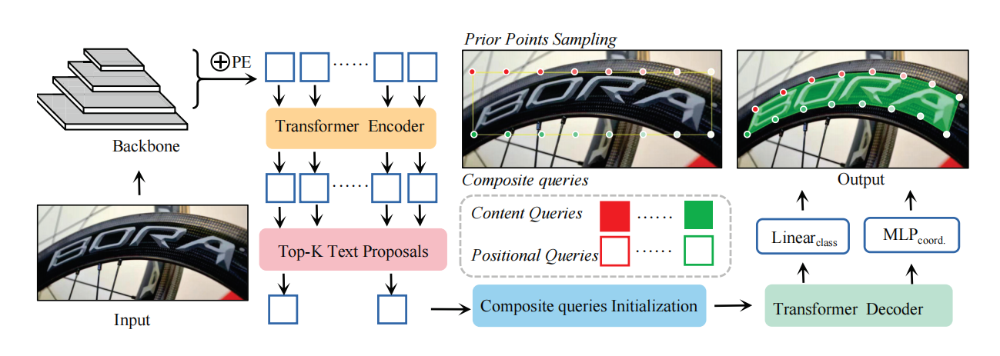

# CPNText-DETR_
CPNText-DETR: Dynamic Contour Initialization and  Normalized Loss for Accurate Arbitrarily Shaped Text  Detection
## Introduction

 Recent transformer-based methods for arbitrarily shaped text detection have
 shown improved performance by predicting text contour points. However,
 these methods often rely on bounding box centers for text contour points
 localization, which may not accurately fall within the text area, and use L1
 loss for contour point regression, causing imbalances across scales. In this pa
per, we propose CPNText-DETR, an innovative method that addresses these
 challenges. Specifically, we introduce a mass-based dynamic point query
 modeling strategy, which dynamically initializes contour points based on the
 mass center of the bounding box, aligning them more closely with the actual
 text shape. Additionally, we present the Contour Point Normalized (CPN)
 loss, which ensures uniform weighting for contour point regression across
 texts of varying scales, thus improving regression balance. Furthermore, we
 introduce the Parallel Enhanced Factorized Self-Attention (PEFSA) mod
ule, which captures intra- and inter-textual relationships, enhancing both
 performance and inference speed. Extensive experiments demonstrate that
 CPNText-DETR achieves state-of-the-art performance, with F-measures of
 89.6%, 89.5%, and 80.1% on the Total-Text, CTW1500, and Art datasets, re
spectively. CPNText-DETR not only surpasses existing methods in detection accuracy but also offers faster inference speed, establishing new benchmarks
 across widely-used datasets.

## Data Preparation
We use the same dataset as DPText-DETR, if you are interested, please visit the following website https://github.com/ymy-k/DPText-DETR
